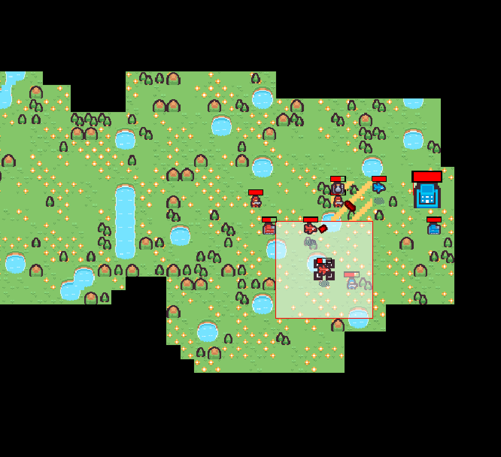
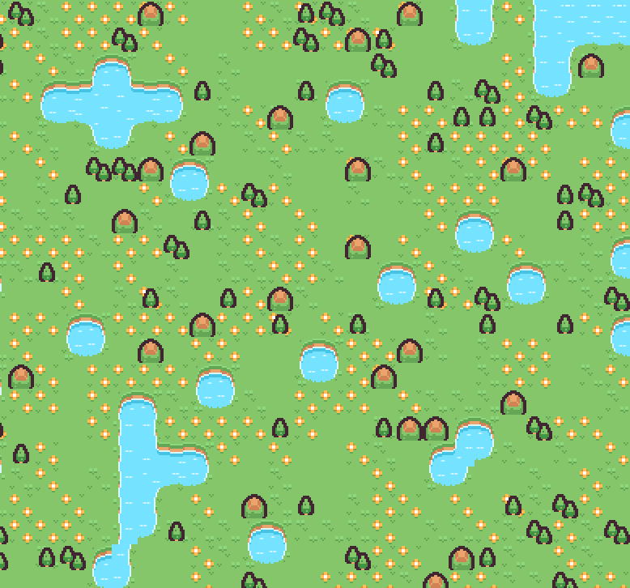
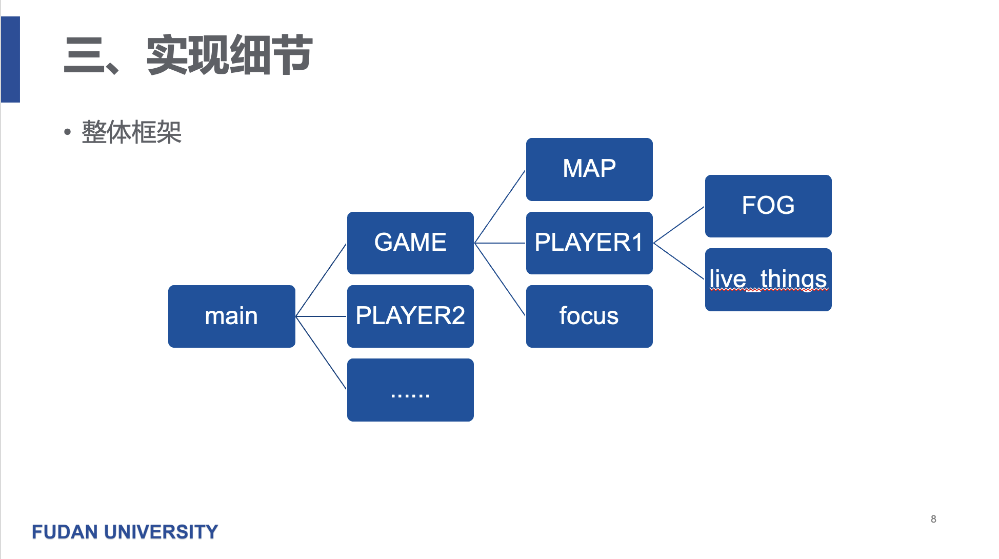
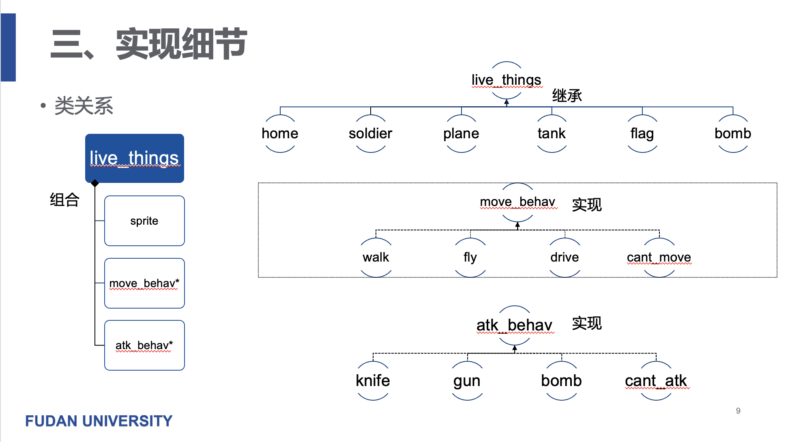
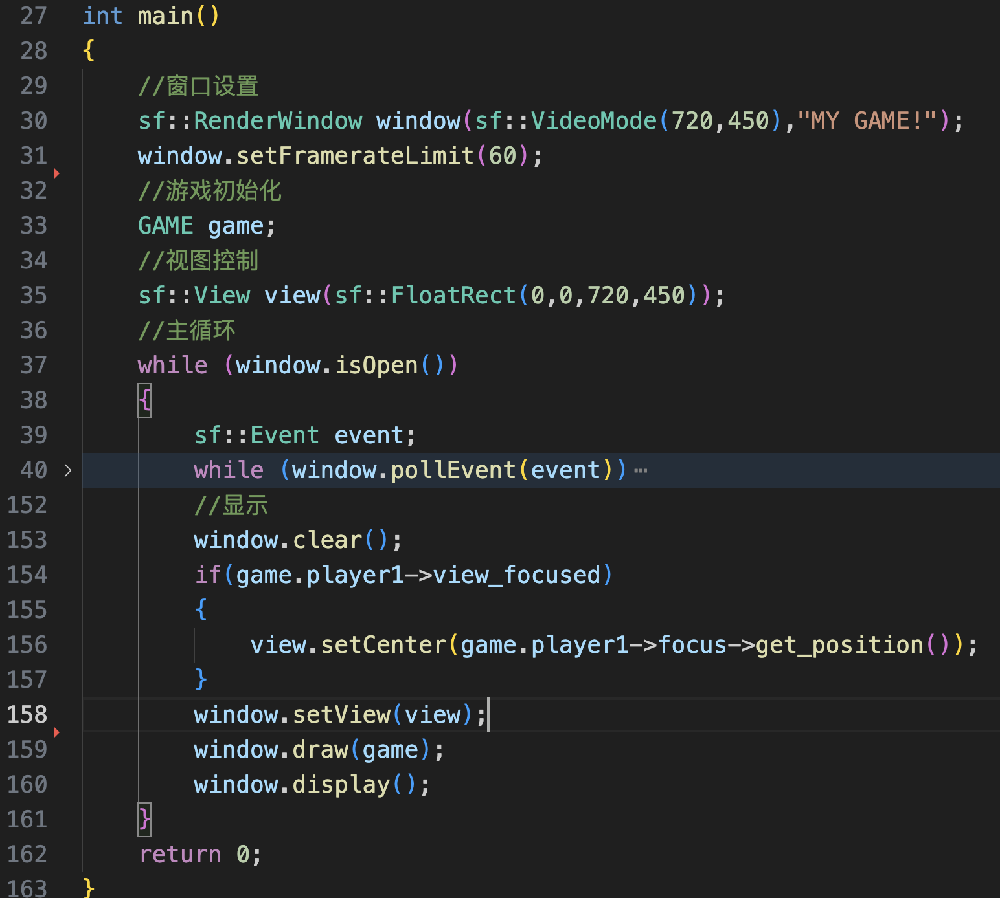
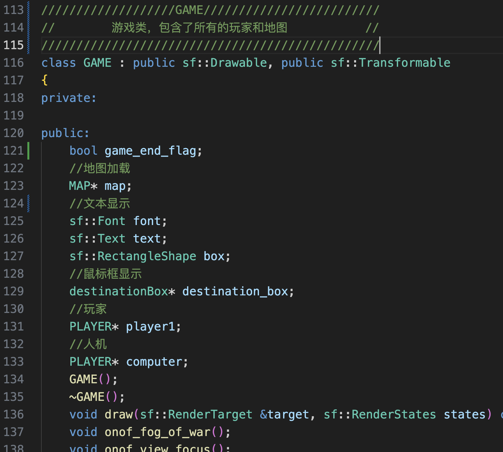
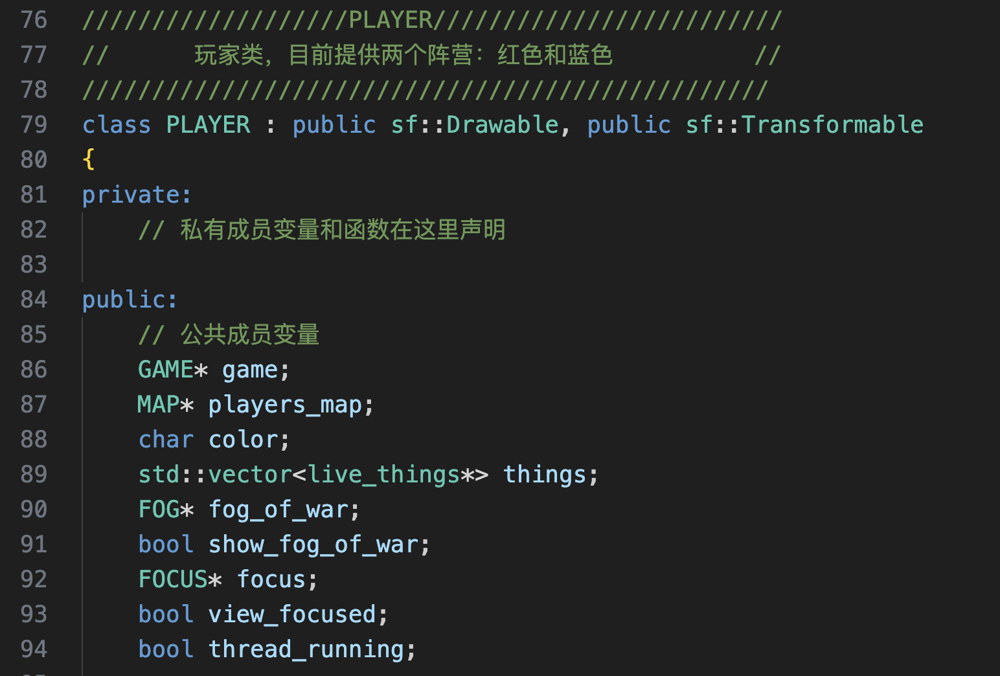
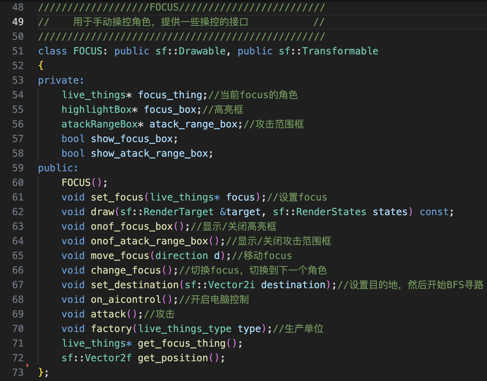
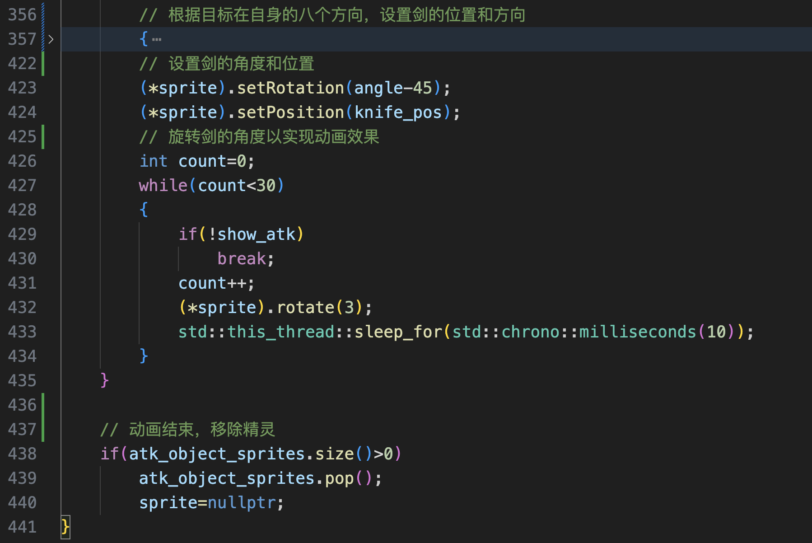
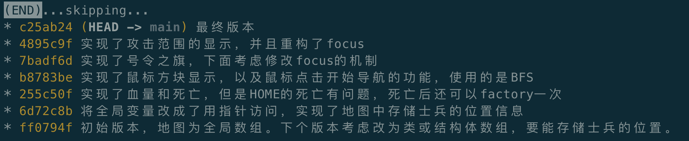

# 一、介绍

​	这是一个基于SFML的c++2D游戏，实现了地图的创建，四类不同的地形，三种不同的士兵和各自的移动方式与攻击方式。提供了方便的人工控制方式，包括：移动、攻击、切换控制角色、显示攻击范围、显示控制角色高量框、生成士兵、呼叫己方士兵、调整视图等功能。另外还实现了电脑控制角色，包括：自动移动、自动攻击、发现敌人时追击、自动生成士兵等行为。



# 二、安装与运行

安装SFML库之后可以在src目录下执行`../bin/game`命令来运行游戏。

# 三、游戏特点

## 1. 合理的水域贴图

​	属性为水的格子会判断相邻格子是水或是陆地，并选择合适的纹理，这样就可以生成合理美观的水域。



## 2. 多种地形、多种士兵、多种移动方式和攻击方式

​	如上图，游戏实现了多种地形：平地、水、山、树林。

​	此外实现了三种士兵：战士、飞机、坦克。他们的移动方式分别为走、飞、开车。他们的攻击方式为剑、子弹、炸弹。


​	战士的移动方式是走，可以通过除了山和水的地形。攻击方式是剑，范围是一格范围内最近的敌人。


​	飞机的移动方式是飞，可以通过所有地形。攻击方式是子弹，范围是三格内最近的敌人。


​	坦克的移动方式是开车，只可以通过平地。攻击方式是炸弹，会在原地安放一个炸弹，2.5秒后爆炸，对一格范围内的所有敌人都造成伤害。

​	所有的攻击方式都制作了攻击动画。

## 3.方便的操作方式

​	游戏有很多便于玩家操作的设计，包括当前操作角色的高量框显示，攻击范围显示，鼠标所指方格显示等。也提供了很多操作方式，包括wasd移动，空格键攻击，tab切换控制角色，\键打开关闭战争迷雾，]键控制攻击范围显示，[键控制高量框显示，‘键控制视角的锁定。当视角不锁定时可以使用方向键移动视角。可以使用- +键控制视角的缩放。

​	另外还提供了一些特色的操作：

1. 按下鼠标使当前控制角色以自己的移动方式按最短路径移动到鼠标按下时所在位置。（战争迷雾笼罩的地方将被视为不可通过）
2. 控制任意士兵单位按下e键会生成一个号令之旗，会召唤所有友军来到旗帜所在地。（旗帜是有动画的）

# 四、实现细节

## 1.设计模式（==汇报时没有详细介绍，在此处补充==）

1. **策略模式**：`move_behavior`和`attack_behavior`类是策略类，它们定义了一系列可以在运行时互相替换的行为。`live_things`类通过组合的方式拥有了这些行为，并且可以在运行时动态改变这些行为。
2. **工厂模式**：`live_things`类中的`factory`函数是一个工厂方法，它根据传入的类型参数创建并返回不同的`live_things`对象。
3. **模板方法模式**：`live_things`类定义了一些函数（如`ai_control`、`die`等），这些函数在`live_things`类中提供默认实现，在派生类中（如`HOME`、`soldier`、`tank`等）被重写。这样，`live_things`类就定义了一个算法的骨架，具体的实现则交给了派生类。
4. **装饰器模式**：`HealthBar`类提供了一个健康条的视觉表示，它可以被添加到`live_things`对象上，为`live_things`对象添加了新的功能（显示健康条），但并不改变`live_things`对象的接口。`highlightBox`、`destinationBox`和`atackRangeBox`类提供了一些视觉表示，它们可以被添加到其他对象上，为这些对象添加了新的功能（显示高亮、目的地和攻击范围），但并不改变这些对象的接口。
5. **组合模式**：`live_things`类包含了`move_behavior`和`attack_behavior`对象，这是一种"有-a"关系，即`live_things`有一个`move_behavior`和一个`attack_behavior`。这种设计使得`live_things`类可以利用已有的行为类来扩展自己的功能，而不需要通过继承来实现。`FOCUS`类包含了`highlightBox`和`atackRangeBox`对象，这是一种"有-a"关系，即`FOCUS`有一个`highlightBox`和一个`atackRangeBox`。这种设计使得`FOCUS`类可以利用已有的类来扩展自己的功能，而不需要通过继承来实现。
6. **桥接模式**：`FOCUS`类和`PLAYER`类都继承了`sf::Drawable`和`sf::Transformable`，这是桥接模式的一个例子。这种模式将抽象部分（如绘制和变换）与它的实现部分（如`FOCUS`和`PLAYER`）分离，使它们可以独立地变化。
7. **单例模式**：`GAME`类是一个单例类


## 2.整体框架






​	mian函数中只负责接收玩家的输入和显示，在这里初始化GAME类。



GAME类中包含地图与各个玩家，可以方便地拓展到多个玩家（不论是人类控制还是电脑控制）



PLAYER类，包含自己的战争迷雾，和自己的单位。



Live_things类，这是一个基类，各种士兵是继承于此基类。其中移动与攻击通过组合的方式实现。

```c++
class live_things : public sf::Drawable, public sf::Transformable
{
public:
    // 纹理和精灵，用于绘制对象
    sf::Texture texture;
    sf::Sprite sprite;

    // 行为控制器，用于控制移动和攻击行为
    move_behavior* move_behav;
    attack_behavior* attack_behav;

    // 视野范围
    int field_of_vision;

    // 颜色标识
    char color;

    // 所属的玩家
    PLAYER* belong_to;

    // 是否由AI控制
    bool AI_controlled;

    // 线程运行状态
    bool thread_running;

    // 是否已经死亡
    bool is_dead;

    // 健康条
    mutable HealthBar health_bar;

    // 当前生命值
    int HP;

    // 目标路径
    std::stack<direction> destination_path;

    // 构造函数
    live_things();

    // AI控制函数
    virtual void ai_control();

    // 关闭线程函数
    void shut_thread();

    // 绘制函数
    virtual void draw(sf::RenderTarget &target, sf::RenderStates states) const;

    // 照亮迷雾函数
    sf::Rect<int> light_up_fog();

    // 获取位置函数
    sf::Vector2f get_position();
    sf::Vector2i get_position_in_map();

    // 死亡函数
    virtual void die();

    // 在地图上移动函数
    void move_in_map(direction d);

    // 工厂函数，用于创建新的live_things对象
    virtual live_things* factory(live_things_type type);

    // 析构函数
    virtual ~live_things();

    // 受到伤害函数
    void take_damage(int damage);

    // 设置目标位置函数
    void set_destination(sf::Vector2i destination);
};
```

focus类，这是player类中提供给外界控制palyer中单位的接口。



## 3.重要细节

### 单位的电脑控制，使用多线程实现

```c++
void live_things::ai_control()
{
    // 使用多线程实现
    std::thread t([this](){
        thread_running=true; // 线程开始运行
        bool path_done=true; // 路径完成标志
        while(thread_running&&!is_dead) // 当线程运行且对象未死亡时
        {
            while(thread_running&&AI_controlled&&!is_dead) // 当线程运行、AI控制且对象未死亡时
            {
                live_things* target=this->attack_behav->find_target(); // 寻找目标
                if(target!=NULL) // 如果找到目标
                {
                    this->attack_behav->atack(); // 攻击目标
                    std::this_thread::sleep_for(std::chrono::milliseconds(2000)); // 休眠2秒
                    continue;
                }
                else if(this->destination_path.size()>0) // 如果有目标路径
                {
                    path_done=false; // 路径未完成
                    direction d=this->destination_path.top(); // 获取路径顶部的方向
                    this->destination_path.pop(); // 弹出路径顶部的方向
                    this->move_in_map(d); // 在地图上移动
                    std::this_thread::sleep_for(std::chrono::milliseconds(500)); // 休眠0.5秒
                }
                else
                {
                    path_done=true; // 路径完成
                    live_things* temp=this->attack_behav->see_target(); // 看到目标
                    if(temp!=NULL) // 如果看到目标
                    {
                        this->set_destination(temp->get_position_in_map()); // 设置目标位置
                        path_done=false; // 路径未完成
                        continue;
                    }
                    direction d=static_cast<direction>(rand()%4); // 随机选择一个方向
                    this->move_in_map(d); // 在地图上移动
                    std::this_thread::sleep_for(std::chrono::milliseconds(1000)); // 休眠1秒
                }
            }
            // 当AI_controlled为false时，清空destination_path，防止一次路径没有走完时由切换到手动控制造成的bug
            if(!path_done)
            {
                while(!destination_path.empty()) // 清空目标路径
                {
                    destination_path.pop();
                }
                path_done=true; // 路径完成
            }
            std::this_thread::sleep_for(std::chrono::milliseconds(1000)); // 休眠1秒
        }
    }); 
    t.detach(); // 分离线程，让它自行运行
}
```

### 寻路算法

​	使用BFS找到最短路径，使用了一个二位数组（类似floyed算法中的prev数组）存放前驱节点。使用队列实现广度优先搜索，使用栈存放路径。

```c++
void live_things::set_destination(sf::Vector2i destination)
{
    // 获取起始位置
    sf::Vector2i start=this->get_position_in_map();

    // 获取迷雾信息和地图信息
    bool* fog_of_war=this->belong_to->fog_of_war->get_fog_of_war();
    node* map=this->belong_to->players_map->get_map();

    // 使用BFS算法，寻找最短路径
    bool visited[MAP_WIDTH][MAP_HEIGHT]; // 访问标记数组
    sf::Vector2i prev[MAP_WIDTH][MAP_HEIGHT]; // 前驱节点数组

    // 初始化访问标记数组
    for(int i=0;i<MAP_WIDTH;i++)
    {
        for(int j=0;j<MAP_HEIGHT;j++)
        {
            visited[i][j]=false;
        }
    }

    // BFS队列
    std::queue<sf::Vector2i> q;
    q.push(start);
    visited[start.x][start.y]=true;

    while(!q.empty())
    {
        sf::Vector2i current=q.front();
        q.pop();

        // 如果到达目标位置，结束搜索
        if(current==destination)
        {
            break;
        }

        // 检查四个方向
        sf::Vector2i directions[4] = {sf::Vector2i(0, -1), sf::Vector2i(0, 1), sf::Vector2i(-1, 0), sf::Vector2i(1, 0)};
        for(int i = 0; i < 4; i++)
        {
            sf::Vector2i next = current + directions[i];

            // 如果下一个位置在地图内，未被访问，可通行，且不在迷雾中
            if(next.x >= 0 && next.x < MAP_WIDTH && next.y >= 0 && next.y < MAP_HEIGHT && !visited[next.x][next.y] && this->move_behav->passable(map, next) && !fog_of_war[next.x+next.y*MAP_WIDTH])
            {
                q.push(next);
                visited[next.x][next.y]=true;
                prev[next.x][next.y]=current;
            }
        }
    }

    // 如果目标位置未被访问，说明无法到达目标位置
    if(!visited[destination.x][destination.y])
    {
        return;
    }

    // 重构路径
    for(sf::Vector2i pos = destination; pos != start; pos = prev[pos.x][pos.y])
    {
        direction d;
        if(pos.x-prev[pos.x][pos.y].x==1)
        {
            d=RIGHT;
        }
        else if(pos.x-prev[pos.x][pos.y].x==-1)
        {
            d=LEFT;
        }
        else if(pos.y-prev[pos.x][pos.y].y==1)
        {
            d=DOWN;
        }
        else if(pos.y-prev[pos.x][pos.y].y==-1)
        {
            d=UP;
        }

        // 将方向压入目标路径栈
        destination_path.push(d);
    }
}
```

### 攻击动画的实现

​	使用多线程实现动画的更新

```c++
void attack_knife::atack()
{
    live_things* target=this->find_target();
    if(target!=NULL&&!target->is_dead)
    {
        target->take_damage(this->ATK);
        std::thread animation_thread(&attack_knife::attack_animation, this, target);
        animation_thread.detach();
    }
}
```

​	以剑为例，动画的实现如下。另外考虑到玩家输入时攻击频率可能会很快，使用队列的方式，每发起一次攻击，就新建一个剑的精灵并入队，动画结束就出队，使用智能指针的方式来避免内存泄露。



```c++
void attack_knife::attack_animation(live_things* target)
{
    // 创建一个新的精灵用于显示攻击动画
    std::shared_ptr<sf::Sprite> sprite=std::make_shared<sf::Sprite>();
    atk_object_sprites.push(sprite);
    *sprite=atk_object_sprite;
```

# 五、效果展示

​	见视频

# 六、总结与未来改进方向

1. ---TODO---将纹理存在内存中，避免重复加载
2. ---DONE---实现对象的攻击、死亡。(爆炸？)
3. ---DONE---创建坦克、飞机类，继承自live_things，实现不同的移动方式
4. ---DONE---将HOME设置为工厂，可以生产步兵、坦克、飞机
5. ---DONE---增加鼠标，实现点击切换focus，导航
6. ---TODO---实现金币系统，实现购买功能
7. ---DONE---实现电脑控制非focus的角色，多线程，实现多个角色同时移动，实现电脑控制的player
8. ---TODO---考虑树木的可破坏性，但是这可能涉及到地图访问的冲突
9. ---TODO---考虑将地图的生成和加载分开，生成地图后保存到文件，加载地图时从文件读取
10. ---HALFDONE--考虑实现移动、攻击的动画，添加攻击范围显示在移动时改变纹理的方向
11. ---DONE---增加开始、结束动画
12. ---TODO--对项目结构、格式的优化，添加注释，解决循环包含的问题，改善函数、变量的调用，内存问题，使用const &这种方式
13. ---DONE---需要对地图进行优化，考虑使用结构体或者类的数组来存储地图信息，将士兵的位置也存储在地图中

